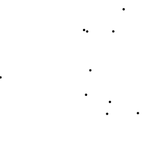
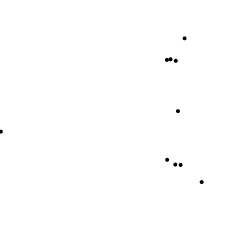
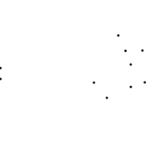
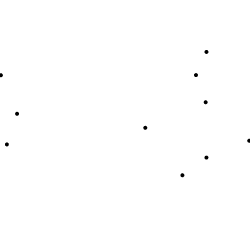
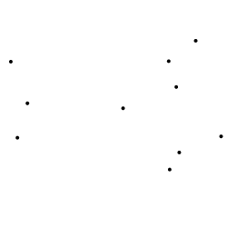
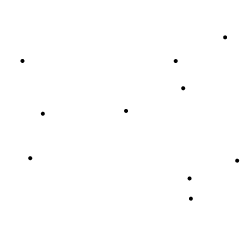
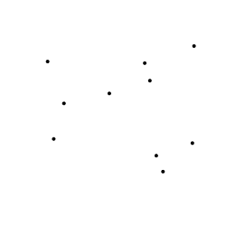
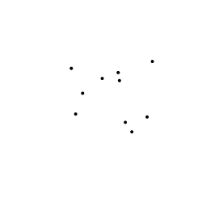
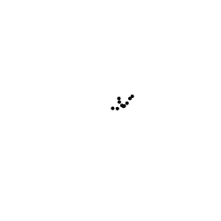

# flock.js
### A simple module to simulate flocking behavior
[usage](#usage) | [settings](#settings) | [demos](#demos)

## Usage
You can create a flock of 10 bodies like so:
```javascript
var f = flock(10);
```
Now you have a flock with 10 fish, birds, flies, or what have you, initialized with default [settings](#settings). The initial positions for the bodies are randomly selected.

Now let's render the flock. Since the flock-space spans 0 to 1 in both x and y dimensions (flock.js is 2d, for now), we need to translate this into canvas coordinates.


And now, let's advance the flock ten ticks at a time with a dt of 0.1 for each tick and see how it moves!

```javascript
for(var i = 0; i < 10; i++) {
    f.tick(0.1);
}
```






Things are a bit slow, so let's fast-forward 100 ticks with the next one:


The flock is programmed to gather on initialization, so that's why you're seeing the flock move towards each other in the snapshots above. Let's try spitting them up!

```javascript
f.scatter()
```









Now let's gather them again, and let's make them gather fast and tight by passing in a strength of x5.

```javascript
f.gather(5);
```








Take a look at some [demos](#demos) for inspiration, and refer to the [complete list of settings](#settings) to customize your flock.

## Settings
When `flock` is invoked with no arguments, the default settings are used. But you can manually specify the settings to customize the behavior of the flock.

| Setting | Default value | Description |
|---------|---------------|-------------|
| `neighborThresholdDist` | `0.2` | The maximum distance between bodies that qualifies them as neighbors, and thus influencing each other's movements. |
| `repulsionThresholdDist` | `0.05` | If two bodies are closer than this distance, they repulse each other. |
| `repulsion` | `0.2` | Bigger the value, the stronger the repulsion when within the threshold distance.  |
| `attraction` | `0.01` | Bigger the value, the stronger the attraction among neighbors. |
| `alignment` | `0.01` | Bigger the value, the stronger the tendency for each body to head towards the same direction as its neighbors. |
| `targetSpeed` | `0.05` | If a body is traveling faster or slower than the target speed, it slows down or speeds up repectively to match the target speed. |
| `targetSpeedMultiplier` | `0.15` | Bigger the value, the faster a body converges to the target speed. |

For example, the following is used in the [Birds of a Feather](http://jiwonk.im/flocks/demos/birds.html) demo to make the flock behave more like birds than a school of fish:

```javascript
var birds = flock(
    NUM_BIRDS,
    {
        neighborThresholdDist: 0.1,
        repulsionThresholdDist: 0.005,
        repulsion: 0.01,
        attraction: 0.05,
        alignment: 0.001,
        targetSpeed: 0.002,
        targetSpeedMultiplier: 0.1
    }
);
```

## Demos

[Beyond the Porthole](http://jiwonk.im/flocks/demos/fish.html)

[Birds of a Feather](http://jiwonk.im/flocks/demos/birds.html)

